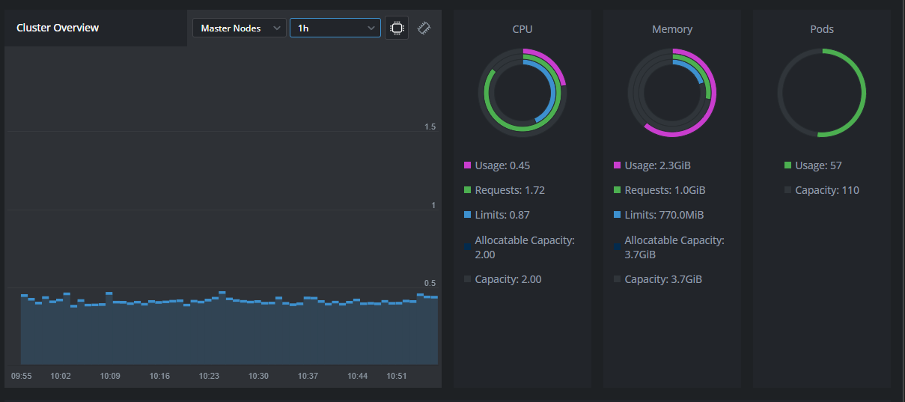
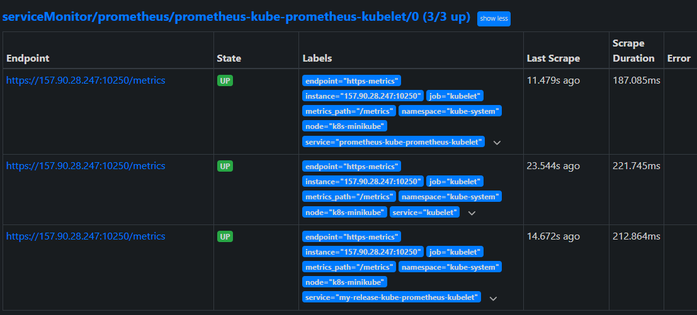

**Необходимо создать кастомный образ и nginx, отдающий свои метрики на определенном endpoint ( пример из офф документаøии в разделе ссылок)**
**Создать deployment запускающий ваш кастомный nginx образ и service для него**
```
 # kubectl apply -f 1_namespaces.yaml 
namespace/homework created

 # kubectl apply -f 2_nginx-configmap.yaml 
configmap/nginx-conf created

 # kubectl apply -f 3_deployments.yaml 
deployment.apps/web-server-deployment created

 # kubectl apply -f 4_services.yaml 
service/web-server-service created

 # kubectl apply -f 5_ingress.yaml 
ingress.networking.k8s.io/main-ingress created

 # curl homework.otus
Testpage ;)

 # curl homework.otus/basic_status
Active connections: 1 
server accepts handled requests
 1 1 1 
Reading: 0 Writing: 1 Waiting: 0 
```
**Установить в кластер Prometheus-operator**
```
# helm repo add prometheus-community https://prometheus-community.github.io/helm-charts
    "prometheus-community" has been added to your repositories

# helm repo update
    Update Complete. ⎈Happy Helming!⎈

# helm install prometheus -n prometheus prometheus-community/kube-prometheus-stack
    NAME: prometheus
    LAST DEPLOYED: Thu Jun  6 08:49:47 2024
    NAMESPACE: prometheus
    STATUS: deployed
    REVISION: 1
    NOTES:
    kube-prometheus-stack has been installed. Check its status by running:
    kubectl --namespace prometheus get pods -l "release=prometheus"

# kubectl --namespace prometheus get pods -l "release=prometheus"
    NAME                                                   READY   STATUS    RESTARTS   AGE
    prometheus-kube-prometheus-operator-774c4cd64d-xpdms   1/1     Running   0          8m12s
    prometheus-kube-state-metrics-7d7654ff7-4pg7f          1/1     Running   0          8m12s
    prometheus-prometheus-node-exporter-9492f              1/1     Running   0          8m13s

$ curl monitoring.homework
<a href="/graph">Found</a>.


```
**Настроить запуск nginx prometheus exporter (отдельным подом или в составе пода с nginx – не принципиально) и сконфигурировать его для сбора метрик с nginx**


**Создать манифест serviceMonitor, описывающий сбор метрик с подов, которые вы создали**
см nginx-prometheus-exporter-deployment

```
# kubectl apply -f 6_service-monitor.yaml 
    servicemonitor.monitoring.coreos.com/nginx-prometheus-exporter-monitor created
```




