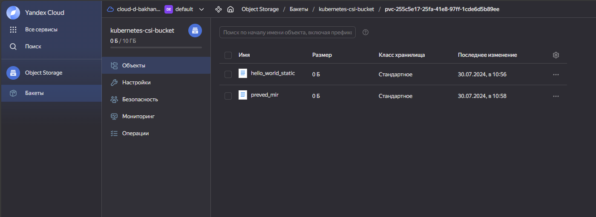

Serviceaccount: k8s-csi-admin
Bucket: kubernetes-csi-bucket

kubectl create -f secret.yaml && \
kubectl create -f k8s-csi-s3/deploy/kubernetes/provisioner.yaml && \
kubectl create -f k8s-csi-s3/deploy/kubernetes/driver.yaml && \
kubectl create -f k8s-csi-s3/deploy/kubernetes/csi-s3.yaml && \
kubectl create -f storageclass.yaml && \
kubectl create -f pvc.yaml && \
kubectl create -f pod-static.yaml 

kubectl exec -ti csi-s3-test-nginx-static -- touch /usr/share/nginx/html/s3/hello_world_static
kubectl exec -ti csi-s3-test-nginx-static -- touch /usr/share/nginx/html/s3/preved_mir

