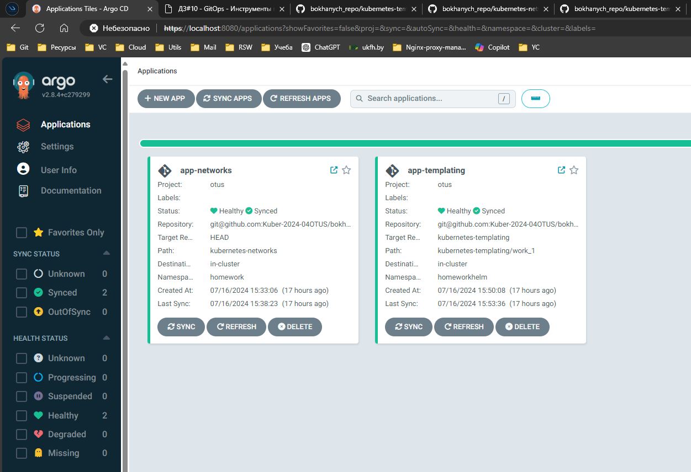

**ArgoCD install:**
```
# Helm pull:
helm pull oci://cr.yandex/yc-marketplace/yandex-cloud/argo/chart/argo-cd --version 5.46.8-6 --untar

# Helm install with my values:
helm install --namespace argocd --create-namespace argocd ./argo-cd/ -f values.yaml

# Get secret:
kubectl get secret -n argocd argocd-initial-admin-secret -o jsonpath="{.data.password}" | base64 -d

# Port forward (access https://localhost:8080):
kubectl port-forward service/argocd-server --namespace argocd 8080:443
```

**App setup:**
```
kubectl apply -f project.yaml

# Label for worker node
kubectl get nodes
kubectl label nodes cl1gr00d3hlh0trbm8r4-ulam homework=true

kubectl apply -f app-networks.yaml

kubectl apply -f app-templating-helm.yaml
```
