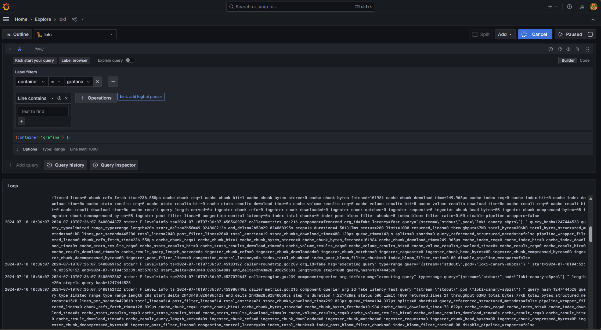

```
# kubectl get node -o wide --show-labels
NAME                        STATUS   ROLES    AGE   VERSION   INTERNAL-IP   EXTERNAL-IP       OS-IMAGE             KERNEL-VERSION      CONTAINER-RUNTIME     LABELS
cl12ug21vakmff8vtjo5-uvoq   Ready    <none>   25h   v1.29.1   10.131.0.15   158.160.134.218   Ubuntu 20.04.6 LTS   5.4.0-174-generic   containerd://1.6.28   beta.kubernetes.io/arch=amd64,beta.kubernetes.io/instance-type=standard-v3,beta.kubernetes.io/os=linux,failure-domain.beta.kubernetes.io/zone=ru-central1-d,kubernetes.io/arch=amd64,kubernetes.io/hostname=cl12ug21vakmff8vtjo5-uvoq,kubernetes.io/os=linux,node-role=worker,node.kubernetes.io/instance-type=standard-v3,node.kubernetes.io/kube-proxy-ds-ready=true,node.kubernetes.io/masq-agent-ds-ready=true,node.kubernetes.io/node-problem-detector-ds-ready=true,topology.kubernetes.io/zone=ru-central1-d,yandex.cloud/node-group-id=cat3v29f2570t4mhb4no,yandex.cloud/pci-topology=k8s,yandex.cloud/preemptible=false

cl1u9nhqassvo1lffr31-yvaz   Ready    infra    25h   v1.29.1   10.131.0.5    158.160.178.21    Ubuntu 20.04.6 LTS   5.4.0-174-generic   containerd://1.6.28   beta.kubernetes.io/arch=amd64,beta.kubernetes.io/instance-type=standard-v3,beta.kubernetes.io/os=linux,failure-domain.beta.kubernetes.io/zone=ru-central1-d,k8slens-edit-resource-version=v1,kubernetes.io/arch=amd64,kubernetes.io/hostname=cl1u9nhqassvo1lffr31-yvaz,kubernetes.io/os=linux,node-role.kubernetes.io/infra=infra,node-role=infra,node.kubernetes.io/instance-type=standard-v3,node.kubernetes.io/kube-proxy-ds-ready=true,node.kubernetes.io/masq-agent-ds-ready=true,node.kubernetes.io/node-problem-detector-ds-ready=true,topology.kubernetes.io/zone=ru-central1-d,yandex.cloud/node-group-id=catimk9pfddrisosok25,yandex.cloud/pci-topology=k8s,yandex.cloud/preemptible=false
```

```
# kubectl get nodes -o custom-columns=NAME:.metadata.name,TAINTS:.spec.taints
NAME                        TAINTS
cl12ug21vakmff8vtjo5-uvoq   <none>
cl1u9nhqassvo1lffr31-yvaz   [map[effect:NoSchedule key:node-role value:infra]]
```

**Loki install:**
```
# helm repo add grafana https://grafana.github.io/helm-charts 
# kubectl create namespace logging 
# helm install --values values.yaml loki --namespace=logging grafana/loki
```

**Promtail install:**
```
# kubectl apply -f promtail.yaml --namespace=logging
```

**Grafana install:**
```
# kubectl create namespace monitoring
# kubectl apply -f grafana.yaml --namespace=monitoring
```
