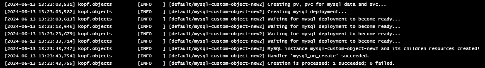
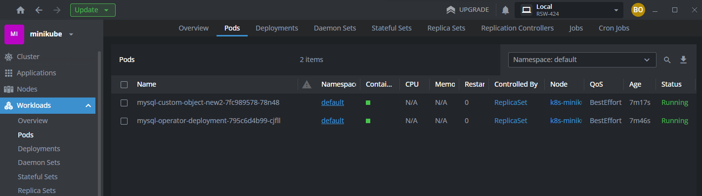

**ЗАПУСК**
```
# ka 1_custom-resource-definition.yaml 
customresourcedefinition.apiextensions.k8s.io/mysqls.otus.homework created

# ka 2_rbac-minimal.yaml 
serviceaccount/user created
clusterrole.rbac.authorization.k8s.io/minimal-access-cluster-role created
clusterrolebinding.rbac.authorization.k8s.io/minimal-access-cluster-role-binding created

# ka 3_deployment.yaml 
deployment.apps/mysql-operator-deployment created

# ka 4_custom-object.yaml 
mysql.otus.homework/mysql-custom-object-new2 created
```
**CHECK**
```
# kubectl get pvc
NAME                           STATUS   VOLUME                        CAPACITY   ACCESS MODES   STORAGECLASS   VOLUMEATTRIBUTESCLASS   AGE
mysql-custom-object-new2-pvc   Bound    mysql-custom-object-new2-pv   1Gi        RWO            standard       <unset>                 3m59s

# kubectl get pv
NAME                          CAPACITY   ACCESS MODES   RECLAIM POLICY   STATUS   CLAIM                                  STORAGECLASS   VOLUMEATTRIBUTESCLASS   REASON   AGE
mysql-custom-object-new2-pv   1Gi        RWO            Retain           Bound    default/mysql-custom-object-new2-pvc   standard       <unset>                          4m8s

# kubectl get crd
NAME                                        CREATED AT
mysqls.otus.homework                        2024-06-13T12:13:58Z

```



